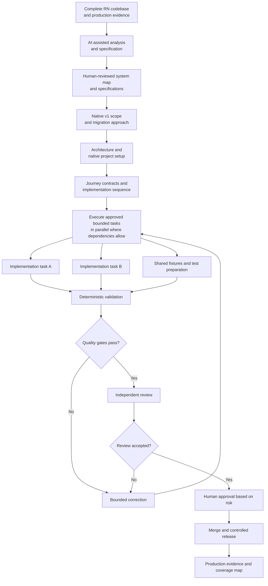

# Native mobile migration

An initial discussion about native migration raised several questions worth examining in more detail. This document sets out the approach I would bring to a deeper technical discussion.

## Proposed approach

The main risk is preserving product continuity while replacing a live application: user state, business behaviour, analytics, and delivery capacity must remain intact. This proposal is a technical position based on limited initial signals, not a fixed implementation plan. Evidence from the codebase and explicit product decisions should refine it.

My starting hypothesis is to build two standalone native applications. React Native (RN) and native coexistence would remain a bounded fallback for cases where replacing the application as a whole proves unsafe.

Delivery would follow complete end-to-end product flows ("journeys") rather than technical layers. For each journey, I would agree the intended native behaviour, identify upgrade and integration risks, and implement it first on a lead platform. The journey would enter the native v1 scope only after passing the agreed validation checks.

iOS is my current hypothesis for the lead platform. Validating a journey there first would allow the team to resolve behavioural and product questions once before implementing the same contract on Android. This is a delivery hypothesis to test against product priorities, team constraints, and the actual codebase. It does not imply completing all of iOS before starting Android.

The migration would also establish the engineering workflow used after cutover: AI-assisted discovery and specification, bounded implementation, deterministic validation, independent review, explicit QA ownership, and production evidence.

---

## Detailed proposal

### 1. Discovery and migration decision

To turn this position into a delivery plan, I would need:

- access to the current mobile code, backend contracts, integrations, release configuration, analytics, and production failure signals;
- timely product decisions on expected behaviour and native v1 scope;
- explicit QA ownership of critical journeys, upgrade validation, and release-candidate assessment;
- an agreed disposition process for RN changes made during migration.

Native implementation should begin only after the entire RN codebase and its operational context have been analysed and decomposed. AI tools would inspect the existing system and produce reviewable specifications covering product journeys, shared logic, state, backend contracts, platform integrations, release configuration, tests, and production behaviour. The team would then use the resulting system map and specifications to decide native v1 scope, the migration approach, architecture and layer boundaries, shared infrastructure, and the initial setup of both native applications.

The discovery should examine these boundaries:

| Signal | Why it changes the estimate |
|---|---|
| Journey behaviour | Meaningful states, errors, and edge cases determine the complexity of each journey |
| Upgrade continuity | Sessions, secure storage, purchases, permissions, and local data may require explicit migration |
| Platform integrations | Push, deep links, analytics, SDKs, and entitlements create work beyond the visible UI |
| Business-logic ownership | Client-owned rules increase duplication and cross-platform consistency risk |
| Backend compatibility | RN and native versions may need to coexist during rollout |
| Quality and release evidence | Existing tests, production monitoring and analytics, reproducible builds, and QA scenarios determine how safely progress can be verified |

The discovery should produce:

- a confirmed migration approach and native v1 scope;
- a journey and dependency sequence for iOS and Android;
- agreed contracts, architecture boundaries, quality gates, rollout and recovery criteria, and QA ownership;
- an estimate based on the inspected system and verified scope.

The default remains two standalone native applications. If discovery shows that replacing an application as a whole would create unacceptable product-continuity or rollout risk, the fallback would be to migrate selected journeys within the existing RN application. Any RN/native coexistence should be temporary, with defined integration boundaries, ownership, release checks, and exit criteria.

### 2. AI-assisted engineering workflow

The following diagram shows one possible execution model for the migration. It defines control boundaries rather than prescribing an agent framework.

Within an approved task, AI may assist with investigation, implementation, test preparation, and review. The task contract keeps behaviour, dependencies, scope, required evidence, and transition gates explicit. Independent tasks should run in parallel only when ownership and integration boundaries are clear.

Builds, tests, contract checks, static analysis, and security checks provide deterministic evidence. Independent review looks for defects and gaps in the reasoning. Product behaviour, architectural commitments, security-sensitive changes, and release risk remain human decisions.

Models and implementation tools are replaceable. Contracts, tests, decisions, coverage records, and Git history remain team-owned.

### 3. Journey-based execution

Once the discovery baseline is approved, each native application needs a working foundation: project structure, application identity and signing, environment configuration, CI, a navigation shell, networking, authentication, observability, and test infrastructure. Each journey can then be implemented as a complete vertical slice against the agreed architecture and dependency sequence. For each journey, I would:

1. Agree which existing behaviours to preserve, improve, drop, or clarify.
2. Define the native behaviour, dependencies, acceptance criteria, analytics, and required evidence.
3. Implement and validate the journey on the lead platform, including state transitions, failure modes, and upgrade behaviour.
4. Update native v1 coverage and use the validated behavioural contract for the next platform.

The first iOS journey should validate the real RN-to-native upgrade path early, including continuity of the state and platform contracts identified during discovery. Testing only a clean installation would not provide sufficient evidence.

Android would implement the validated behaviour through its own platform-appropriate architecture.

This cadence requires timely product decisions about current behaviour and native v1 scope.

If the RN application continues to change during migration, every accepted change should receive an explicit native v1 disposition: `include`, `defer`, `replace`, or `exclude`. Its effect on coverage and delivery capacity would then remain visible.

### 4. Product contracts and shared logic

My working assumption is that security-sensitive and business-critical decisions remain backend-owned. Swift and Kotlin should align through typed contracts and shared fixtures, decision tables, or test vectors.

Discovery should identify any substantial client-owned logic before the team selects a sharing strategy:

| Option | Use when | Main ownership cost |
|---|---|---|
| Native implementations with shared contracts and tests | Client-owned rules are limited or most decisions remain backend-owned | Some duplicated implementation |
| Shared core | A narrow body of complex client-owned logic justifies reuse across both platforms, and a production-representative technical experiment validates the integration | Cross-platform debugging, interop, build integration, shared-module ownership, and coupled core releases |

The shared-core technology, such as Swift or Kotlin Multiplatform, should be selected separately based on team ownership, toolchain constraints, and the integration cost on both platforms. I would not introduce a shared runtime without a production-representative technical experiment and a clearly identified body of logic that justifies its long-term cost.

### 5. QA ownership

The migration needs explicit ownership of product quality throughout delivery, not only ad hoc checks before release. QA should understand the business context and critical journeys, maintain repeatable end-to-end scenarios, explore edge cases and platform behaviour, validate RN-to-native upgrades, assess release candidates, and help investigate production failures.

Automation should protect contracts, state migration, upgrade continuity, and repeatable regressions.

If dedicated QA capacity is unavailable, these responsibilities move to the mobile engineers. That reduces implementation capacity, removes part of the independent validation, and should be reflected in the estimate rather than treated as incidental work.

### 6. Migration completion and cutover evidence

Native v1 does not need automatic parity with every historical RN behaviour. Migration completion does require explicit evidence for every journey inside the agreed cutover scope:

| Area | Required evidence |
|---|---|
| Product coverage | Every included journey has an agreed behaviour decision and a verified implementation |
| Upgrade path | Supported RN versions preserve required authentication, secure storage, local state, purchases, permissions, and push registration |
| Platform continuity | Application identity, signing, entitlements, links, subscriptions, and receipts remain valid |
| Backend compatibility | RN and native versions can coexist safely during rollout |
| Product analytics | Identity, attribution, critical events, and journey signals remain comparable |
| Quality | Regression, reliability, and relevant performance thresholds meet the production baseline |
| Controlled rollout | The native version expands in stages, and each stage confirms upgrade continuity and meets the agreed reliability, product, and business thresholds before further expansion |
| Recovery | The team can identify affected cohorts, halt expansion, contain server-controlled behaviour, and issue a corrective release |

Internal testing, beta distribution, and store approval reduce risk but do not confirm migration completion. Store release begins production validation. The rollout should expand in stages where the distribution platform supports it: App Store phased release on iOS and Google Play staged rollout on Android. Before release, the team should agree the criteria to expand or halt the rollout, the required monitoring and server-controlled mitigations, release-blocking defects, and a tested hotfix process.

Feature completion only opens the cutover-validation stage. The migration is complete after the agreed rollout target has been reached, the production observation period has passed within the agreed quality thresholds, upgrade continuity has been confirmed for supported users, and the RN release path has been retired. Any remaining RN/native coexistence must be explicitly excluded from the completed scope, with separate ownership and exit criteria.
